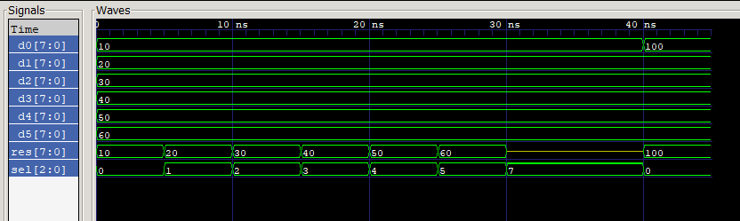

# Design of Multiplexer 6-to-1 (8 bits data buses)

The goal is to develop a *design* of **6-to-1 multiplexer** and *testbench* for it. 

Input and output buses are *8 bits* long. Output can take on *'Z' state* in case the selector input provides *invalid value*.

The *result* of test is **as expected**:
