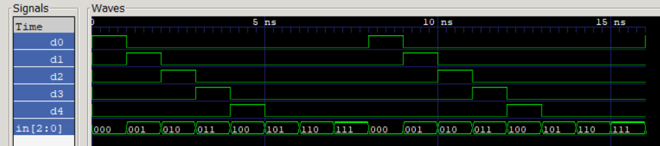

# Design of Decoder 3-to-5 

The goal is to develop a *design* of **3-to-5 decoder** and *testbench* for it. 

One input with size of *3 bits* and 5 outputs each *1 bit* in size. Decoder does not process input values like: *101, 110, 111*.

The *result* of test is **as expected**:
