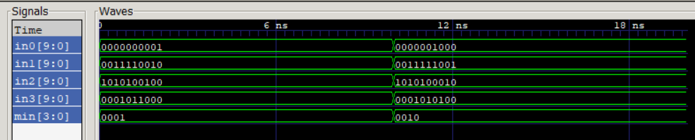

# Design of Finding the Minimum

The goal is to develop a device to find the *minimum of the 4 inputs' four least significant digits*. Each input is *10 bits in width*. *Testbench* is required for it as well. 

The *result* of test is **as expected**:
