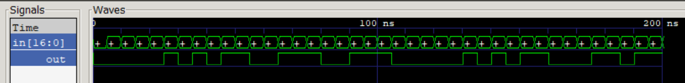

# Design of Majority 17

The goal is to develop a device according to the *Majority Function* ([link](https://en.wikipedia.org/wiki/Majority_function)). The number of inputs - *17*. Write a *testbench* for it. 

The *result* of test is **as expected**:
