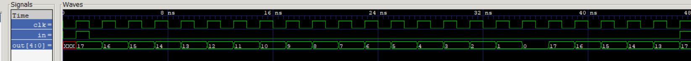

# Design of Counter 17-to-0

The goal is to develop a *counter from 17 to 0 with reset*. When it gets to 0, it *automatically* wraps around to 17. Reset: 1 - set counter to 17, 0 - enable counting.

The *result* of test is **as expected**:
