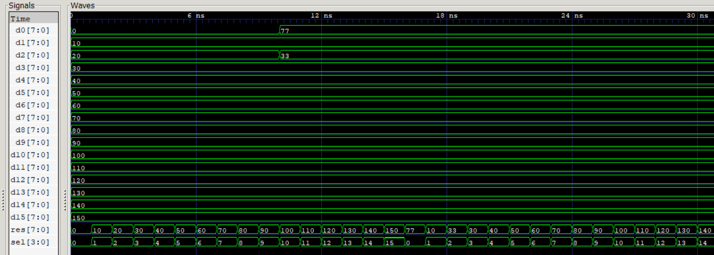

# Design of Multiplexer 16-to-1 out of Multiplexers 4-to-1

The goal is to develop a 16-to-1 multiplexer out of 4-to-1 multiplexers. The whole design of 16-to-1 MP is built upon the combination of 4-to-1 MPs.

The *result* of test is **as expected**:
