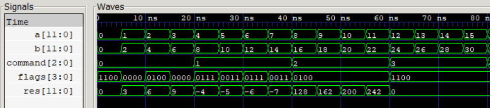
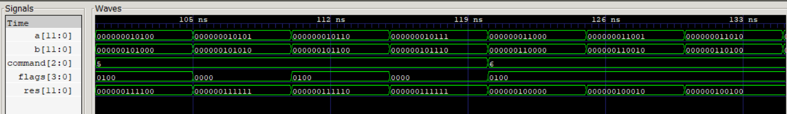

# Design of ALU

The goal is to develop an *ALU*. The supported operations are (on A and B operands): 
```
A + B           addition
A - B           subtraction
A * B           multiplication
A / B           division
A & B           AND
A | B           OR
~A & B          (custom)
~A | B          (custom)
```
The required *flags: null, parity, sign and carry*. 

The *results* of test is **as expected** (just few examples):

